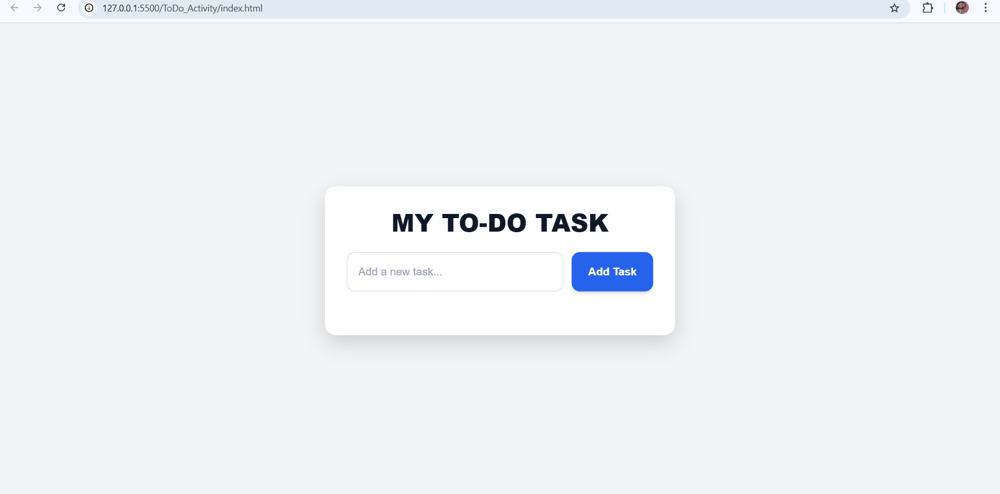

# ToDoTask\_MiniProject

A lightweight **JavaScript To‑Do app** to manage daily tasks.

## 🚀 Live Demo

👉 [Click here](https://tiwari23122004.github.io/ToDoTask_MiniProject/)

---

## ✨ Features

* 📝 Add new tasks
* 🗑️ Delete tasks
* 🚫 Prevent empty items
* ♻️ Minimal UI

---

## 📸 Preview



---

## ⚡ Quick Start

```bash
git clone https://github.com/tiwari23122004/ToDoTask_MiniProject.git
cd ToDoTask_MiniProject
# Open index.html in browser
```

---

## 🛠️ Tech Stack

* HTML
* CSS
* Vanilla JavaScript

---

## 📄 License

This project is licensed under the **MIT License** — feel free to use and modify.
